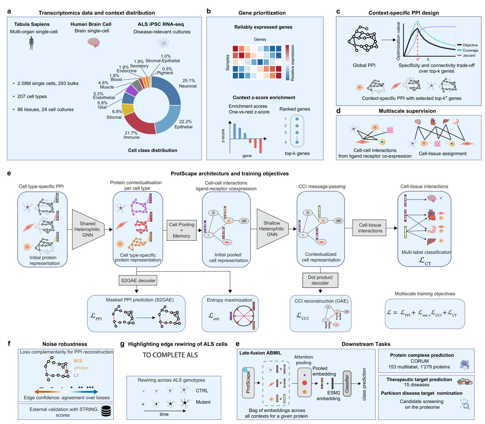

# ProtScape

**Geometric deep learning for context-specific protein interactomes**

**Authors:** Alois Thomas, Lisa Fournier, Vincent Jung, Pascal Frossard, Rickie Patani, Raphaëlle Luisier and Cédric Vincent-Cuaz<br>
**Correspondence:** [Cédric Vincent-Cuaz](mailto:cedric.vincent-cuaz@unibe.ch)<br>
**Paper:** preprint forthcoming · **Data and pretrained models:** release forthcoming

[](assets/protscape_overview.pdf)

## Overview

ProtScape is a multiscale framework for learning context-specific protein representations across proteins, cells and tissues. It combines protein foundation-model features, graph representation learning over context-specific interactomes, and hierarchical cell–cell and cell–tissue supervision. The repository includes construction of the cellular-context networks, model pretraining and inference, CORUM protein-complex and therapeutic-target prediction.

## Installation

```bash
git clone https://github.com/AI-for-RNA-Biology/ProtScape.git
cd ProtScape

conda env create -f environment.yml
conda activate protscape
```

Dataset processing additionally uses:

```bash
conda env create -f environment_scrna.yml
conda env create -f environment_cellphonedb.yml
```

## Data and configuration

Set input and output paths in [`configs/paths.yaml`](configs/paths.yaml). Large datasets, checkpoints and generated outputs are stored outside the repository.

Requirements for rebuilding the networks are documented in [`data_processing_bulk/README.md`](data_processing_bulk/README.md). Links to the processed datasets and released checkpoints will be added here when the accompanying archive is public. After downloading the archive, extract its graph bundle with:

```bash
unzip /path/to/ProtScape_release/data/networks_bulk.zip \
    -d /path/to/ProtScape_release/data
```

## Usage

Run commands from the repository root:

```bash
# Build the context-specific networks and metagraph
conda activate protscape-scrna
bash data_processing_bulk/run_pipeline.sh all

# Train the main ProtScape model
conda activate protscape
bash scripts/run_pretraining.sh

# Generate embeddings from the released main checkpoint
python -m pretraining.inference \
    /path/to/ProtScape_release/models/pretraining/protscape_main_state_dict.pt

# Train the validation-selected downstream configurations
python -m downstream_tasks.run_selected corum
python -m downstream_tasks.run_selected therapeutic_targets

# Recompute analyses and their plots
bash scripts/run_analysis.sh
```

Detailed instructions:

- [Dataset processing](data_processing_bulk/README.md)
- [Pretraining and inference](pretraining/README.md)
- [Downstream tasks](downstream_tasks/README.md)
- [Analyses and plots](exploration/README.md)

## Repository structure

```text
data_processing_bulk/   Context-specific PPIs and metagraph construction
pretraining/            ProtScape and adapted PINNACLE training and inference
downstream_tasks/       CORUM and therapeutic-target prediction
exploration/            Analysis and plotting code
configs/                Data paths and model configurations
scripts/                Workflow entry points
```

## Citation

Citation information will be added with the preprint.
